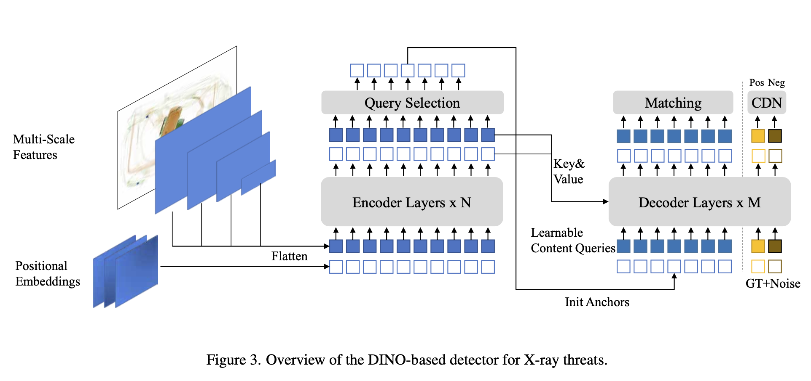
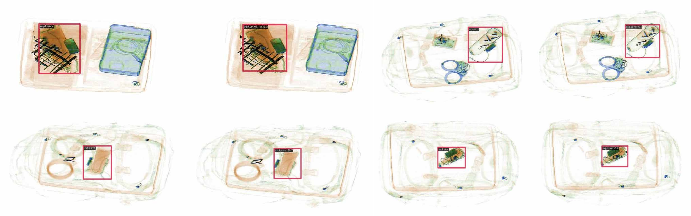
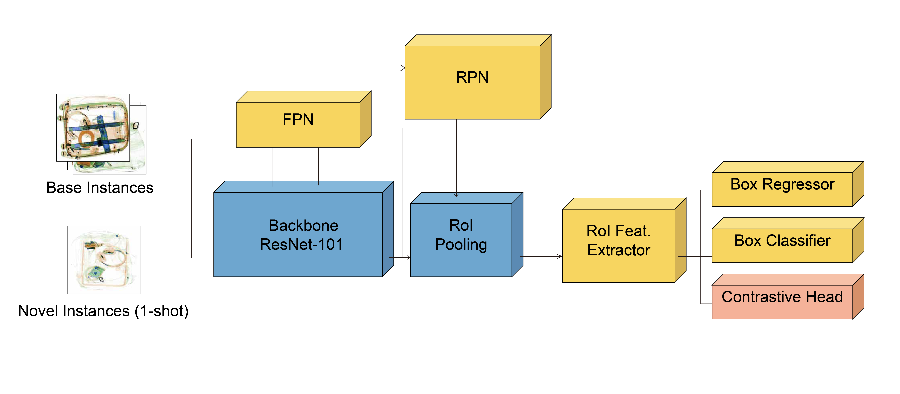
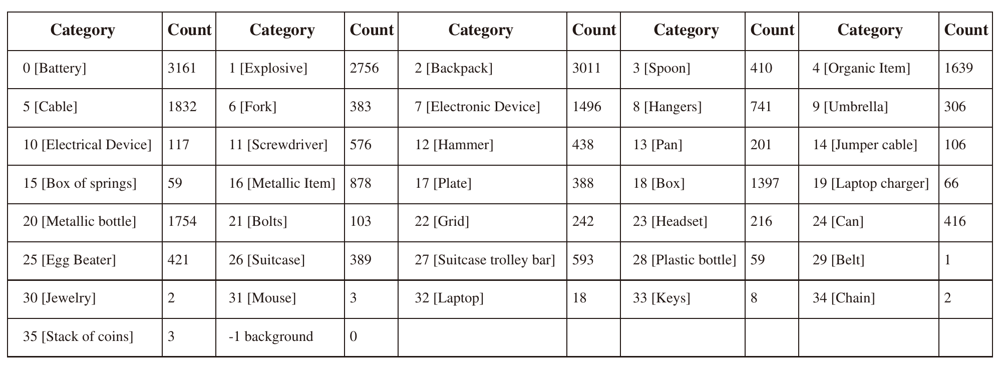
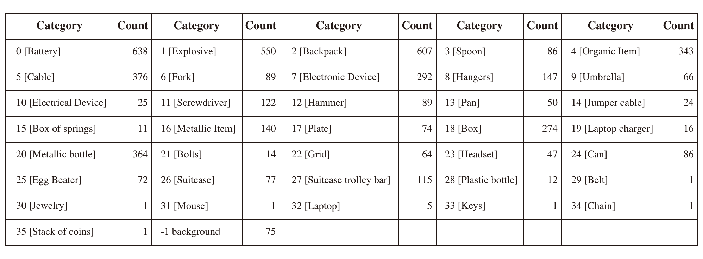
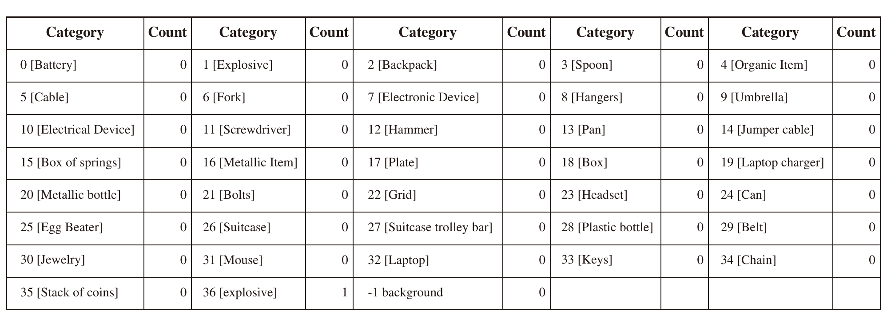
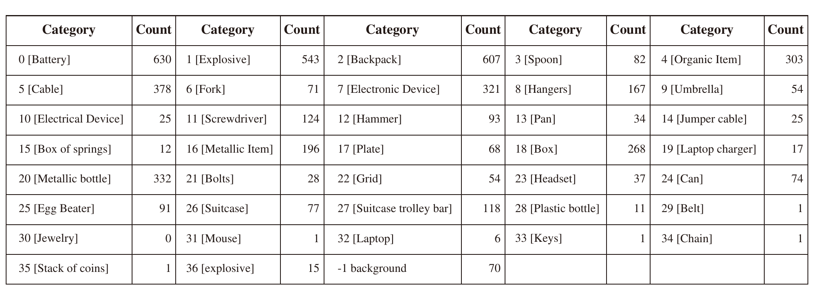
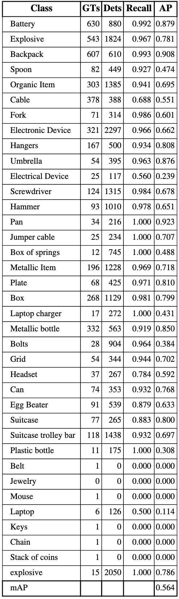

# 📘 Experimental Devices, Dataset, and Model Summary
The dependencies for DINO are listed in `mmdetection_requirements`, and those for the few-shot experiments are listed in `fewshot_requirements.txt`; it is recommended to create two separate environments.


## 🖥️ Experimental Device

```text
+-----------------------------------------+----------------------+----------------------+
|   1  NVIDIA GeForce RTX 4090        Off | 00000000:07:00.0 Off |                  Off |
| 39%   60C    P2             324W / 450W |  12717MiB / 24564MiB |    100%      Default |
|                                         |                      |                  N/A |
+-----------------------------------------+----------------------+----------------------+
```

---

Dataset download link:

```
https://kuacae-my.sharepoint.com/:f:/g/personal/100065148_ku_ac_ae/Eu3jYuhl_WlAhPSGQc7HOCMBzlWmYt2SvKI8jzZNEyPTTQ?e=1sIRdy
```

Place the downloaded files under the `data/` directory.

---

# 📦 Data Acquisition and Dataset Construction

We construct and use a small, task-oriented **X-ray security inspection dataset** and combine it with a public dataset to study **few-shot learning**. The dataset is carefully controlled in terms of imaging device, acquisition procedure, class composition, occlusion levels, and scene complexity.

---

## 1️⃣ Imaging Device & Acquisition Procedure

* Collected using the **ANER K8065** commercial conveyor-based X-ray inspection system.
* System parameters (voltage, current, belt speed, dual-energy spectrum) are fixed to ensure reproducible imaging.
* **Flat-field correction** and **standard-material quality control** are performed at every startup.
* To simulate realistic challenges in X-ray security inspection (material stacking, spectral hardening, scattering, boundary weakening, etc.), we design:

  * Multi-layer material stacking
  * Object pose variations
  * Different levels of occlusion

---

## 2️⃣ Dataset Scale & Composition

A total of **400 X-ray images** are collected:

| Sample Type | Count | Description                                                   |
| ----------- | ----- | ------------------------------------------------------------- |
| Positive    | 100   | 4 types of self-made simulated explosives, 25 images per type |
| Negative    | 300   | Daily objects, no threat items                                |

Positive samples adopt a **mixed placement strategy** to increase occlusion and clutter.

### 🔁 Cross-Type Generalization (Leave-One-Type-Out)

We use a **1/2/3 → 4** leave-one-type-out evaluation protocol to simulate “unknown threats.”

### 🌐 Public Dataset Used: STCray

* Contains **46,642 image–text pairs**
* Covers **21 threat categories** (e.g., IEDs, 3D-printed firearms)
* We construct **few-shot** splits based on its explosive subset

---

## 3️⃣ Occlusion-Level Design: Simple vs. Occlusion

The 100 positive samples are divided into:

| Category      | Count | Characteristics                                               |
| ------------- | ----- | ------------------------------------------------------------- |
| **Simple**    | 80    | No or weak occlusion, clear object boundaries                 |
| **Occlusion** | 20    | Strong occlusion, material overlap, pseudo-color interference |

All explosives are **manually segmented**, and bounding boxes are generated from masks to ensure annotation accuracy.

The occlusion design is inspired by:

* **OPIXray:** OL1 / OL2 / OL3
* **PIDray:** easy / hard / hidden

Additional occlusion and disguise patterns include:

* Metal mesh
* Tight containers
* Electronic component boxes
* Chains and similar disguises

Different occlusion strategies are used for training and testing to avoid distribution leakage.

---

# 📊 Baseline Model Performance (Overall mAP@0.5:0.95)

```text
DINO                0.813
Deformable-DETR     0.749
Faster R-CNN        0.676
YOLOv10s            0.596
YOLO-Pro            0.530
Swin Transformer    0.467
ViTDet              0.350
```

(DINO achieves the best performance.)

---

# 🚀 DINO Configuration (Core Settings)

We train DINO using **MMDetection** for single-class detection (`explosive`).

## 🔧 Network Architecture

### Backbone

* ResNet-50
* Pretrained on ImageNet (`torchvision://resnet50`)
* Using C3–C5 feature maps
* Mapped to 256-dim features via a **4-scale ChannelMapper**

### Transformer Head

* 6-layer Encoder and 6-layer Decoder
* **900 object queries**
* **with box refine** enabled
* **Hungarian matching** for assignment

### Loss Functions

* Focal Loss (classification): α=0.25, γ=2.0
* L1 Loss (box regression weight 5.0)
* GIoU Loss (weight 2.0)

### Data Augmentation (Training)

1. Random horizontal flip with probability 0.5
2. One-of-two policy:

   * Multi-scale resizing (short side in [480, 800])
   * Large-scale resizing → random cropping → multi-scale resizing

### Training Settings

* Batch size = 16
* Epochs = 12
* Optimizer = AdamW
* Initial learning rate = 2e-4; backbone lr = 0.1 × base lr
* Gradient clipping: max norm = 0.1
* MultiStepLR: lr decayed by 0.1 at epoch 11

---

# 🖼️ DINO Architecture Diagram



---

# 📌 DINO Training Experiments

## 1️⃣ Training on Full Dataset (Simple + Occlusion)

```bash
CUDA_VISIBLE_DEVICES=1 python tools/train.py \
./my_configs/dino-4scale_r50_improved_8xb2-1000e_explosive_dataset_coco.py
```

## 2️⃣ Simple → Occlusion Transfer

```bash
CUDA_VISIBLE_DEVICES=1 python tools/train.py \
./my_configs/dino-4scale_r50_improved_8xb2-12e_explosive_coco_1.py
```

## 3️⃣ Cross-Type Generalization (1–3 → 4)

```bash
CUDA_VISIBLE_DEVICES=1 python tools/train.py \
./my_configs/dino-4scale_r50_improved_8xb2-12e_explosive_coco.py
```

Qualitative results:



---

# 🌱 Few-Shot Learning (FSCE)

# 🖼️ FSCE Architecture Diagram



## 🧱 FSCE Architecture

* Backbone: ResNet-101 (Caffe pretrained), Stage 1 frozen

* FPN: 5-scale feature pyramid

* RPN:

  * Aspect ratios = {0.5, 1.0, 2.0}
  * Base anchor size = 8
  * Classification: Sigmoid cross-entropy
  * Regression: L1 Loss

* RoI Head: Shared2FCBBoxHead

* RoIAlign: 7×7

* Number of classes: 36

### Optimizer and Training Schedule

* Optimizer: SGD, lr = 0.02, momentum = 0.9
* Weight decay = 1e-4
* Step learning rate schedule, 100-iteration warmup
* Learning rate decays at 12,000 and 16,000 iterations
* Total training iterations: 60,000

### Sampling Strategy

| Module | Positive IoU | Negative IoU | Pos:Neg Ratio |
| ------ | ------------ | ------------ | ------------- |
| RPN    | ≥ 0.7        | ≤ 0.3        | 1:1           |
| RoI    | ≥ 0.5        | ≤ 0.5        | 1:3           |

### Testing

* NMS IoU threshold = 0.5
* Score threshold = 0.05
* Maximum 100 detections per image

---

## 📚 Few-Shot Pipeline

### Base Stage (Data Illustration)




---

## 1️⃣ Base Training

```bash
CUDA_VISIBLE_DEVICES=1 python tools/detection/train.py \
configs/detection/fsce/voc/split1/fsce_r101_fpn_voc-split1_base-training.py --gpus 1
```

---

## 2️⃣ Initializing BBox Head (Few-Shot Pre-initialization)

```bash
CUDA_VISIBLE_DEVICES=1 python tools/detection/misc/initialize_bbox_head.py \
--src1 work_dirs/fsce_r101_fpn_voc-split1_base-training/latest.pth \
--method random_init \
--save-dir work_dirs/fsce_r101_fpn_voc-split1_base-training
```

---

## 3️⃣ Few-Shot Fine-Tuning (1-Shot)

Few-shot stage data:




```bash
CUDA_VISIBLE_DEVICES=1 python tools/detection/train.py \
configs/detection/fsce/voc/split1/fsce_r101_fpn_voc-split1_1shot-fine-tuning.py --gpus 1
```

Final performance:


